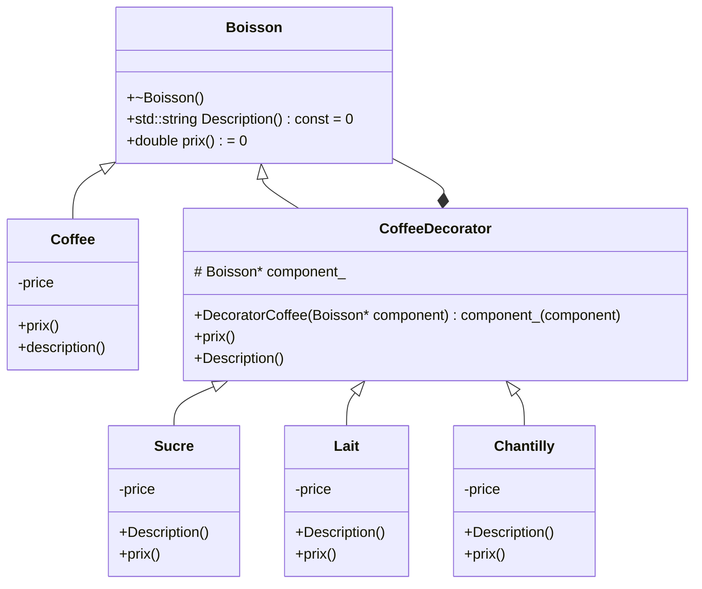

# Decorator

Exemple de la machine à café : 
Une machine à café qui pourrait permettre de rajouter dans le café du sucre, du lait ou de la chantilly.
L'ajout de tout ces ingrédients fait monter le prix.
Le programme permet de fermer à la modification et d'ouvrir à l'extension.
En rajoutant des "Décorateurs" qui doivent hériter de CoffeeDecorator.

