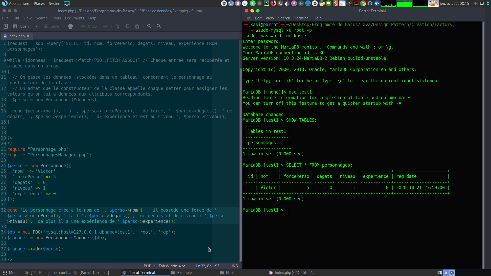

# Base de donnée PHP

Ce code permet de :
- Par raffraichissement de la page rentrer les informations présente dans le fichier index.php dans la BDD associé au fichier index.php.

## Lancement de la base de donnée sous Linux :
<code>
sudo systemctl start mysql.service
</code>

## Création de la base de donnée :

Se connecter en tant que utilisateur root :
sudo mysql -u root -p

Lister les bases de données sur le serveur :
CREATE DATABASE 'yourDB';

Lister les bases de données :
SHOW DATABASES;

Utiliser une base de donnée:
use test1

AFFICHER LES TABLES d'une base:
SHOW TABLES;

CREER UNE TABLE :
CREATE TABLE personnages (
id INT(6) UNSIGNED AUTO_INCREMENT PRIMARY KEY,
nom VARCHAR(255),
forcePerso INT,
degats INT,
niveau INT,
experience INT,
reg_date TIMESTAMP DEFAULT CURRENT_TIMESTAMP ON UPDATE CURRENT_TIMESTAMP
)

## Références

Inspiré du tutoriel Openclassroom : https://openclassrooms.com/fr/courses/1665806-programmez-en-oriente-objet-en-php/1666289-manipulation-de-donnees-stockees
