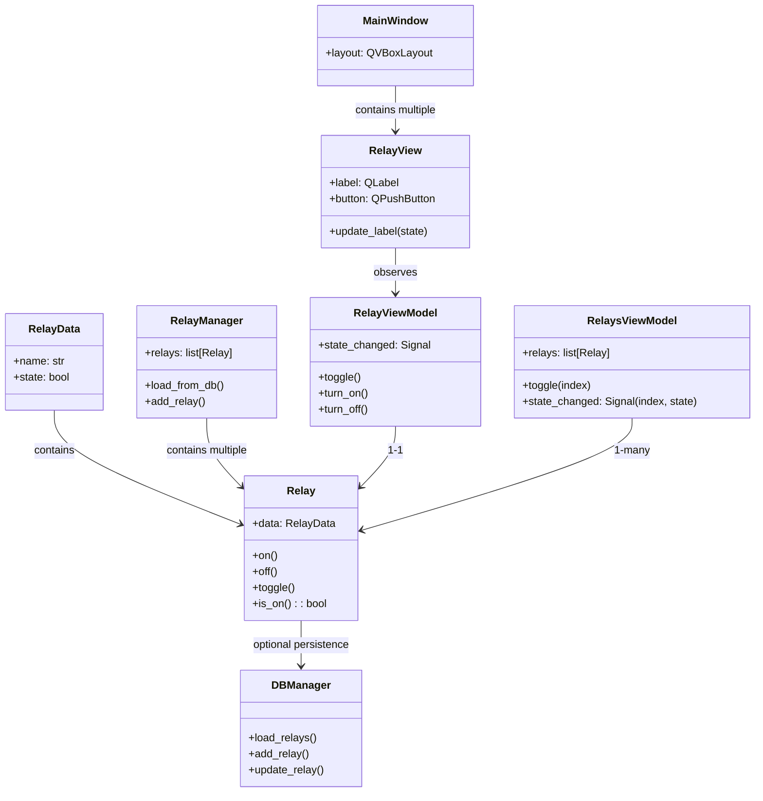

| Aspect             | MVVM                                  | MVC                              |
|-------------------|---------------------------------------|---------------------------------|
| Relation Vue/Modèle| Vue <-> ViewModel <-> Modèle          | Vue <- Controller -> Modèle      |
| Signalisation     | Signaux Qt (data binding)             | Vue appelle controller manuellement |
| Couplage          | Vue et modèle découplés via VM        | Vue et modèle découplés via Controller |
| Adapté pour       | Data binding complexe, UI réactive    | Logique simple, événements directs |

Association : 

