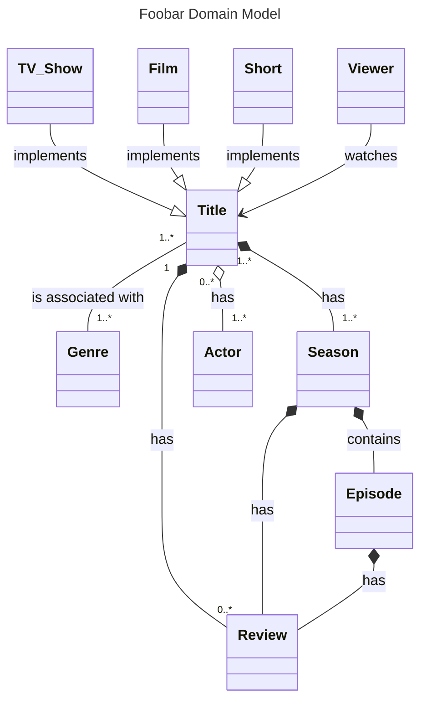

```mermaid
---
title: Foobar Domain Model
---
classDiagram
    Title "1..*" -- "1..*" Genre: is associated with
    Title "1..*" *-- "1..*" Season: has
    Title "1" *-- "0..*" Review: has
    Title "0..*" o-- "1..*" Actor: has

    TV_Show --|> Title: implements
    Film --|> Title: implements
    Short --|> Title: implements

    Viewer --> Title: watches

    Season *-- Review: has
    Season *-- Episode: contains

    Episode *-- Review: has
```