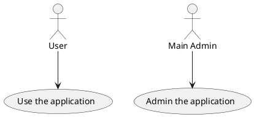
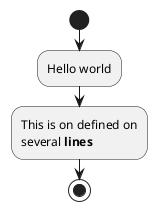
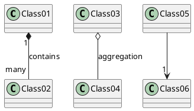

# L'Auto Ecole

Une auto-école souhaite construire une application pour gérer les entrainements et examens théoriques du code de la route de ses élèves.
Chaques élève est identifié par un numéro unique et est caractérisé par un nom, un prénom, une addresse et une date de naissance.

Chaque élève assiste à plusieurs séances de code (autant qu'il le souhaite) et chaques séance est identifié par une date et une heure.
A chaque séance de code, le directeur de l'auto-école génère une série caractérisée par une suite de questions (40) sélectionnées aléatoirement parmi 8 catégories.

Lorsqu'un élève assiste à une séance. Il obtient le nombre de fautes (une note sur 40) qu'il a faites pour la série passée pendant la séance.

Lorsqu'un élève a obteny, au cours de 4 séances consécutives, un nombre de fautes inférieur ou égal à 5, le directeur de l'auto-école l'autorise a passer l'examen théorique du code de la route à une date donnée.
(Un seul examen par date donnée).

L'auto-école ne peut présenter que 8 élèves maximum à chaques date d'examen. Les élèves ayant obtenu plus de 5 fautes à l'examen sont recalés et doivent assister de nouveau à des séances de code avant de pouvoir se représenter à l'examen.

## Diagramme de cas d'utilisation

## Diagramme d'activité

## Diagramme de classe

## Diagramme de séquence

