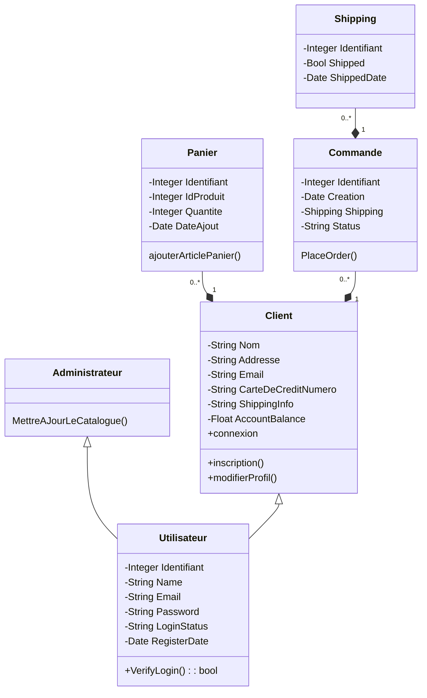

# Click And Collect

```mermaid
classDiagram
    
    class Administrateur {
        MettreAJourLeCatalogue()
    }
     Administrateur <|-- Utilisateur
    
    class Utilisateur {
        -Integer Identifiant
        -String Name
        -String Email
        -String Password
        -String LoginStatus
        -Date RegisterDate
        +VerifyLogin() : bool
    }
    Client <|-- Utilisateur
    
    class Client {
        -String Nom
        -String Addresse
        -String Email
        -String CarteDeCreditNumero
        -String ShippingInfo
        -Float AccountBalance
        +inscription()
        +connexion
        +modifierProfil()
    }
    
    class Panier {
        -Integer Identifiant
        -Integer IdProduit
        -Integer Quantite
        -Date DateAjout
        ajouterArticlePanier()
    }
    Panier "0..*" --* "1" Client
    
    class Commande {
        -Integer Identifiant
        -Date Creation
        -Shipping Shipping
        -String Status
        PlaceOrder()
    }
    Commande "0..*" --* "1" Client
    
    class Shipping {
        -Integer Identifiant
        -Bool Shipped
        -Date ShippedDate
    }
    Shipping "0..*" --* "1" Commande
```
