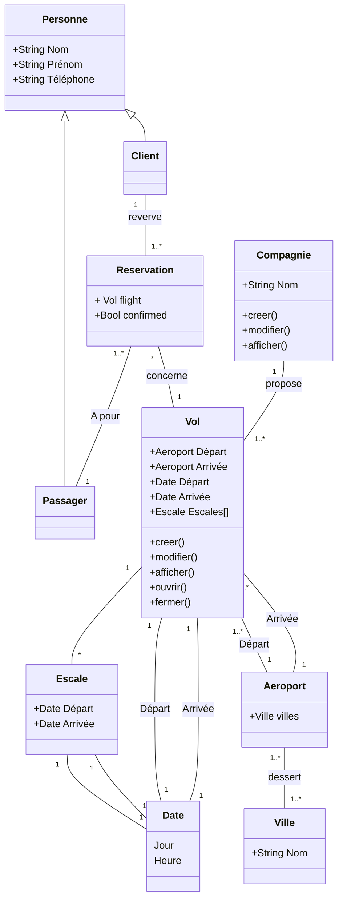

# Cas réservation des vols

On souhaite gérer les réservartions de vols effectués dans une agence.
D'après les interviews avec les membres de l'agence, on sait que :

- Les compagnies aériennes proposent différents vols.
- Un vol est ouvert à la reservation et refermé sur ordre de la compagnie
- Un client peut réserver ou ou plusieurs vols pour des passagers différents.
- Une réservation concerne un seul vol et un seul passager
- Une réservation peut être confirmée ou annulée
- Un vol a un aéroport de départ et d'arrivée.
- Un vol a un jour et une heure de départ, un jour une heure d'arrivée.
- Un vol peut comporter des escales dans un ou plusieurs aéroports.
- Une escale a une heure de départ et une heure d'arrivée
- Chaques aéroports dessert une ou plusieurs villes.

