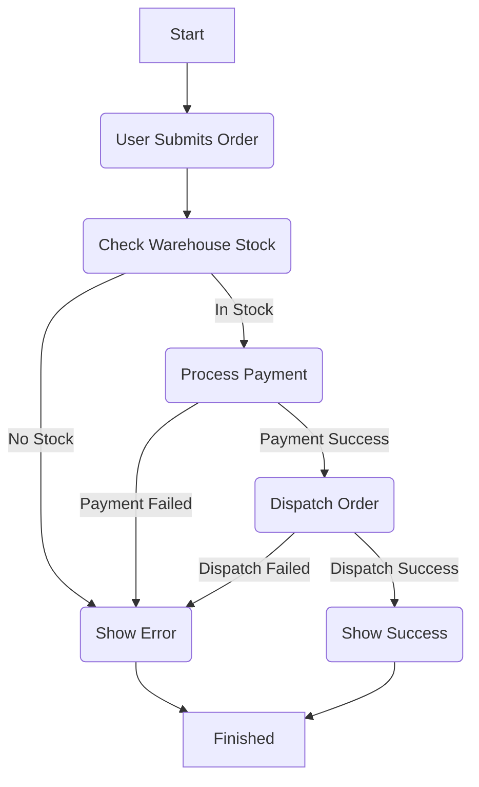
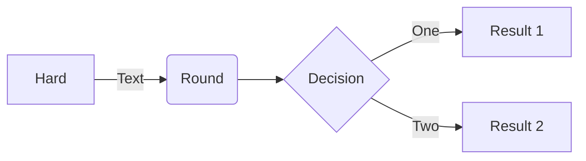

```mermaid
flowchart TB
   Start --> USO;
   USO(User Submits Order) --> CWS;
   CWS(Check Warehouse Stock) -->|In Stock| PP
   CWS -->|No Stock| SE
   SE(Show Error) --> Finished
   PP(Process Payment) -->|Payment Success| DO
   PP -->|Payment Failed| SE
   DO(Dispatch Order) --> |Dispatch Success| SS
   DO -->|Dispatch Failed| SE
   SS(Show Success) --> Finished   
```

```mermaid
flowchart LR

A[Hard] -->|Text| B(Round)
B --> C{Decision}
C -->|One| D[Result 1]
C -->|Two| E[Result 2]
```