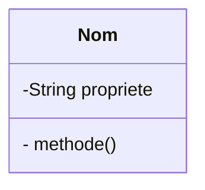
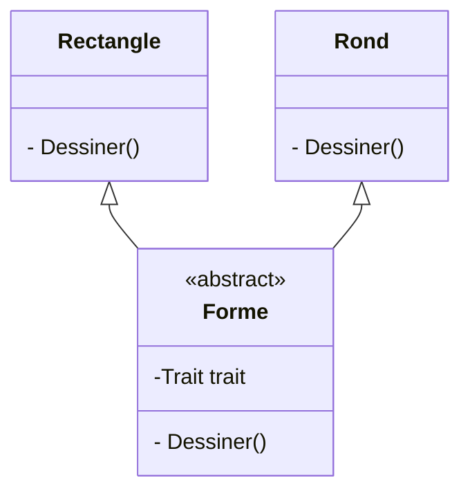
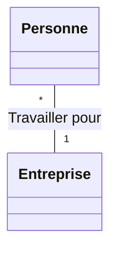
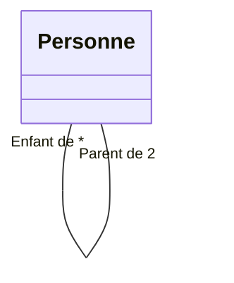
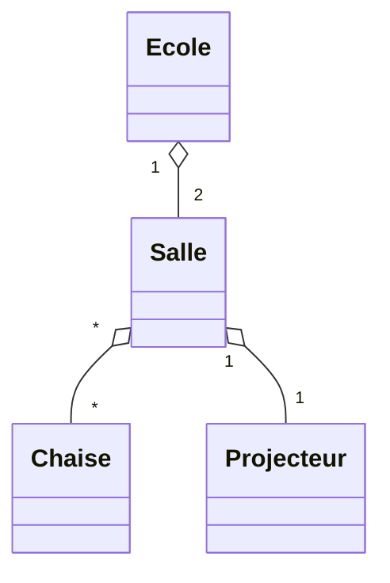
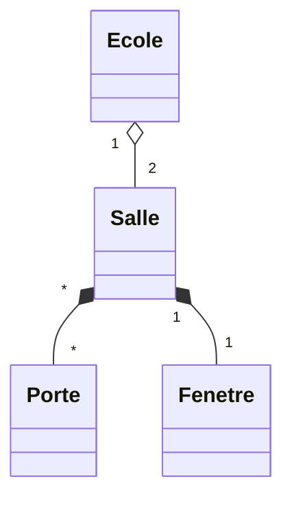
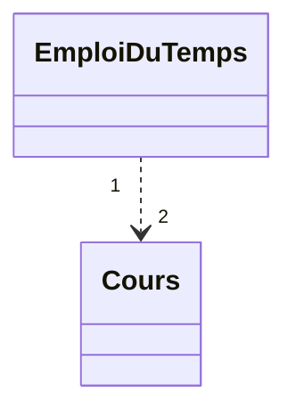
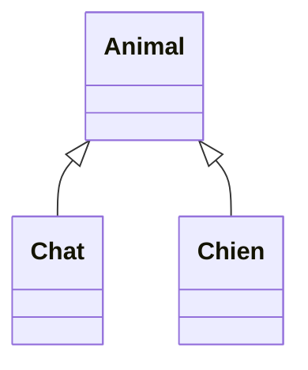

# UML (Universal Media Langage)

Grady Booch, Ivar Jacobson et James Rumbaugh ont créé le langage de modélisation unifié en 1995 alors qu'ils travaillaient chez Rational Software.
UML est destiné à faciliter la conception des documents nécessaires au développement d'un logiciel orienté objet, comme standard de modélisation de l'architecture logicielle. Les différents éléments représentables sont : Activité d'un objet/logiciel.

## Diagramme de classe

Considéré comme le plus important de la modélisation (objet). Il décrit l'architecture interne d'un projet mais d'une façon statique, les aspects dynamiques sont traités à partir des diagrammes de séquences, d'activité ou d'état-transition.

La classe comprend : 
- Un nom : Ecrite en CamelCase
- Un ou des attributs
  - `Nom`
  - Type de donnée
    - `String`
    - `Int`
  - Visibilité
    - `+` : public, l'attribut est visible partout
    - `` : rien, l'attribut est visible que dans le paquetage ou se trouve la classe
    - `#` : protected, visible dans la classe ou pour ses descendants
    - `-` : private, visible uniquement dans la classe
- De méthodes

## Attribut de classe

Il s'agit d'un attribut fixe définit dans le classe et qui garde une valeur unique dans l'ensemble des objets descendants.
Exemple Pi.
Cette attribut est généralement souligné. <u>Pi</u>=3.14

## Attribut dérivé

Est un attribut qui est calculé à partir d'un autre attribut il sont notés avec un /deviant.
Exemple /age --> Qui dépend de la date de naissance.

## La classe abstraite

Définisse des classes dont les méthodes ne sont pas implémentés.
Elles sont implémentés par les classes dérivées.

## Interfaces

Une interface regroupe un ensemble d'opérations mais pas d'implémentation.

Ceci représente l'avantage de :
- Définir en début d'analyse pour voir l'envergure du projet et faire le squelette et la répartition des classes dans les packages.
- Peut être commune à plusieurs classes et être implémenté différement en fonction des classes.

## Les relations

Les relations les plus utilisés sont : 
- L'association
  - Représente les liens qui existent entre les classes, elle peut être binaire ou n-aire.
- L'agrégation
- La composition
- L'héritage
- La dépendance

### L'association

Association reflexive

### L'agrégation

Définie une relation d'inclusion

### La composition (ou agrégation forte)

Définie une relation d'inclusion. **La destruction du composite détruit les composants**.

### La dépendance

Relation uni-directionnelle. 
Une modification de la cible implique une modification de la source.

### L'Héritage

Relation entre une classe générale et une classe spécialisé.

## Comment representer un diagramme UML sous PC

### Gratuit

- Mermaid
- PlantUML
- StarUML
- DrawIO
- LucidChart
- Graphviz
- LibreOffice Draw